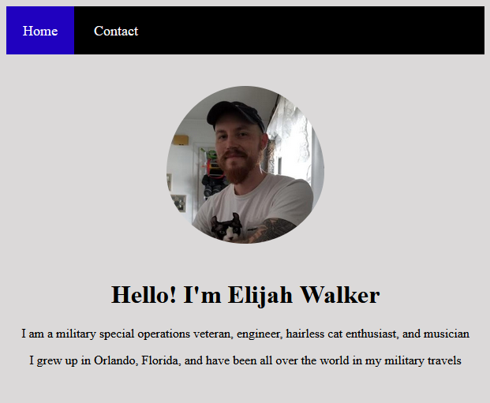

Elijah Walker's Personal Website

Task 1 of Software Development Mastermind

Summary

Task 1 of Software Development Mastermind, a mentoring program ran by Andy Sterkowitz is to create a very basic website. The website includes a homepage with a centered photo and text. Additionally, it contains a contact page with a fake phone number in email. Both webpages contain a navigation bar, which changes color to show your current page. It will also change background and font color when the mouse is hovering over the page link in the navbar.

Author

Elijah C Walker - Systems Engineer